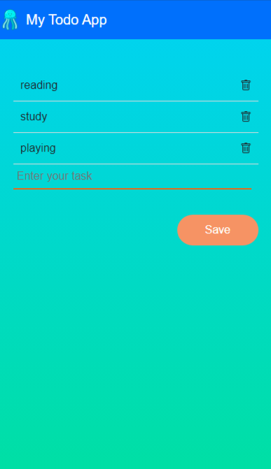

# React Todo App

A simple and interactive Todo application built with React. This project demonstrates basic React concepts, state management, and component-based architecture. It allows users to add, edit, and remove tasks, with a focus on a user-friendly interface.

## Features

- **Add Tasks**: Users can add new tasks by typing in the input field and pressing Enter.
- **Edit Tasks**: Tasks can be edited by clicking on them.
- **Remove Tasks**: Tasks can be removed by clicking the delete icon.
- **Save Tasks**: A Save button is provided to save the list of tasks.
- **Date Navigation**: Users can navigate between dates using a calendar icon to see tasks for different days.

## Screenshots



## Installation

1. **Clone the repository:**
   ```sh
   git clone https://github.com/yourusername/react-todo-app.git
   cd react-todo-app
